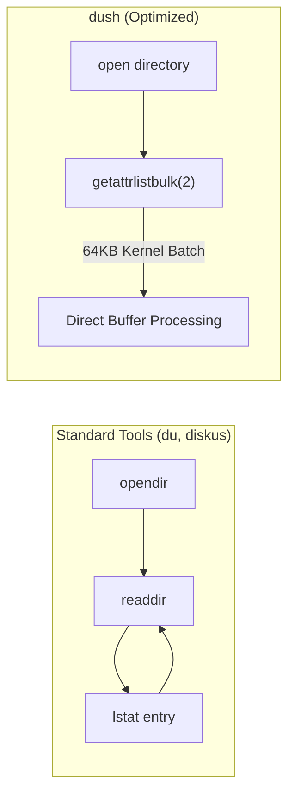

<div align="center">

# dush

**A blazing fast, drop-in replacement for `du -sh` on macOS**

[](https://ziglang.org)
[-black?logo=apple&style=flat-square)](https://apple.com)
[](#features)
[](https://opensource.org/licenses/MIT)

<br/>


<br/>

[Features](#features) • [Benchmarks](#benchmarks) • [Quick Start](#quick-start) • [Usage](#usage) • [How It Works](#how-it-works) • [Testing](#testing)

</div>

---

`dush` computes disk usage with exact numerical and string parity to BSD `du -sh`, but runs **3x+ faster** on macOS by replacing traditional `readdir` + `lstat` traversal loops with kernel-level `getattrlistbulk(2)` batching and a lock-free work-stealing threadpool.

## Features

- **Exact `du -sh` Parity** — Byte-for-byte identical output format using BSD `humanize_number` scaling (`0B`, `1.0K`, `49K`, `1.5M`, `10G`), tab alignment, and error handling.
- **3x+ Faster than BSD `du`** — Traverses hundreds of thousands of files in milliseconds, outperforming both macOS `du -sh` and Rust-based `diskus`.
- **Kernel Syscall Batching** — Ingests file names, types, allocation sizes, and inode IDs in 64KB kernel batches via `getattrlistbulk(2)`—eliminating individual `fstatat` syscalls.
- **Work-Stealing Concurrency** — Multi-threaded traversal with hardware-scaled worker threads, thread-local directory stacks, and byte accumulators.
- **Hardlink Deduplication** — Accurately tracks inode references across APFS and HFS+ volumes so hardlinked files are never double-counted.
- **Full Flag Support** — Drop-in compatibility for `-s`, `-h`, `-c` (grand total), `-A` (apparent size), `-k`/`-m`/`-g` (block units), and `-L`/`-H`/`-P` (symlink controls).
- **Zero Runtime Dependencies** — Written in pure Zig 0.16 and links only system `libc`, producing a single standalone binary.

## Benchmarks

Benchmarked on Apple Silicon (macOS Sequoia) using `hyperfine` with cache warmup and statistical isolation. Output parity is verified against `du -sh` before every timing run.

> [!NOTE]
> All benchmarks run with `--shell none` to eliminate subshell spawning overhead and use interleaved executions so CPU frequency scaling affects all tools equally.

### 1. Real-World Workload (Developer Directory: 165,000 files, 18,000 dirs, ~10.8 GB)

| Command | Mean [ms] | Min [ms] | Max [ms] | Relative Speed |
|:---|---:|---:|---:|---:|
| **`dush`** | **211.2 ± 5.9** | **200.5** | **219.1** | **1.00** (fastest) |
| `diskus` | 277.0 ± 9.8 | 259.3 | 289.9 | 1.31x slower |
| `du -sh` | 669.4 ± 31.0 | 642.3 | 716.9 | 3.17x slower |

*Summary:* `dush` runs **3.17x faster** than macOS `du -sh` and **1.31x faster** than [`diskus`](https://github.com/sharkdp/diskus).

---

### 2. Synthetic Stress Test (Deep hierarchies, sparse extents, symlinks, hardlinks)

| Command | Mean [ms] | Min [ms] | Max [ms] | Relative Speed |
|:---|---:|---:|---:|---:|
| **`dush`** | **16.4 ± 2.5** | **12.8** | **29.7** | **1.00** (fastest) |
| `diskus` | 24.8 ± 2.2 | 19.7 | 28.6 | 1.51x slower |
| `du -sh` | 41.7 ± 3.3 | 37.5 | 52.2 | 2.54x slower |

## Quick Start

### Build & Install

Requirements: [Zig](https://ziglang.org) 0.16.x (`brew install zig`)

```sh
# Clone and build optimized release binary
git clone https://github.com/aksheyd/dush.git
cd dush
make

# Install to /usr/local/bin (default) or custom PREFIX
sudo make install
```

> [!TIP]
> Add an alias to your `~/.zshrc` or `~/.bashrc` to replace `du -sh` transparently:
> ```sh
> alias du="dush"
> ```

## Usage

```sh
dush [OPTIONS] [PATH ...]
```

If no path is provided, `dush` defaults to the current directory (`.`).

### Options

| Flag | Description |
|:---|:---|
| `-s` | Display summary total for each target directory (default) |
| `-h` | Human-readable output using 1024-byte scaling: `B`, `K`, `M`, `G` (default) |
| `-c` | Display a grand total row at the end |
| `-A` | Use apparent file length instead of disk block allocation |
| `-k` | Output size in 1024-byte (1 KiB) blocks |
| `-m` | Output size in 1,048,576-byte (1 MiB) blocks |
| `-g` | Output size in 1,073,741,824-byte (1 GiB) blocks |
| `-P` | Do not follow any symbolic links (default) |
| `-H` | Follow symbolic links specified on the command line |
| `-L` | Follow all symbolic links encountered during traversal |

### Examples

**Current directory usage:**
```sh
$ dush
252K	.
```

**Multiple targets with grand total (`-c`):**
```sh
$ dush -c src bench tests
 40K	src
 16K	bench
8.0K	tests
 64K	total
```

**Apparent size (`-A`) of sparse files:**
```sh
$ dush -A sparse_image.dmg
10G	sparse_image.dmg
```

**Fixed block units (`-m`):**
```sh
$ dush -m node_modules
450	node_modules
```

## How It Works

Traditional disk usage utilities on macOS bottleneck on POSIX filesystem APIs:



### 1. `getattrlistbulk(2)` Syscall Batching
Standard tools invoke `lstat` or `fstatat` for every single file in a directory. For a project with 100,000 files, this triggers 100,000 separate user-to-kernel context switches.

`dush` requests attributes via Darwin's `getattrlistbulk(2)` using a 64KB kernel buffer. In a single syscall, macOS returns file names, inode types, physical block allocations (`ATTR_CMN_OWNERID` / `ATTR_FILE_ALLOCSIZE`), and link counts for hundreds of files at once.

### 2. Zero-Allocation Traversal
File paths are not heap-allocated during traversal. Regular files and symlinks are evaluated directly within the bulk attribute buffer. Heap allocations are reserved strictly for subdirectories pushed onto traversal stacks.

### 3. Work-Stealing Concurrency
Worker threads operate on thread-local stacks to maximize CPU cache locality. When a worker's local stack empties, it steals directory batches from the global work queue using low-contention atomic synchronization.

### 4. Hardlink Deduplication
When `st_nlink > 1`, `dush` checks an inode set before adding physical block allocations. Files with `st_nlink == 1` bypass deduplication checks entirely, keeping fast paths lock-free.

## Testing

Run unit tests and the comprehensive end-to-end parity test suite:

```sh
# Run Zig unit tests
make test

# Or run tests directly
zig build test
python3 tests/test_dush.py
```

The parity suite validates exact match against BSD `du -sh` across:
- Single and multi-target inputs
- Flag permutations (`-sh`, `-hs`, `-c`, `-A`, `-k`, `-m`, `-g`)
- Symlink behaviors (`-P`, `-L`, `-H`)
- Sparse files and inode deduplication for hardlinks
- Deep recursion chains (25+ levels) and nonexistent paths

## Benchmarking Suite

The hermetic benchmark harness isolates the Python fixture generator from shell orchestration:

```sh
# Benchmark dush against du -sh and diskus on a generated synthetic tree
make bench

# Benchmark on an arbitrary directory
sh bench/bench.sh ./dush /path/to/target

# Benchmark with cold cache (purges OS page cache via sudo purge)
sh bench/bench.sh ./dush /path/to/target --cold
```
